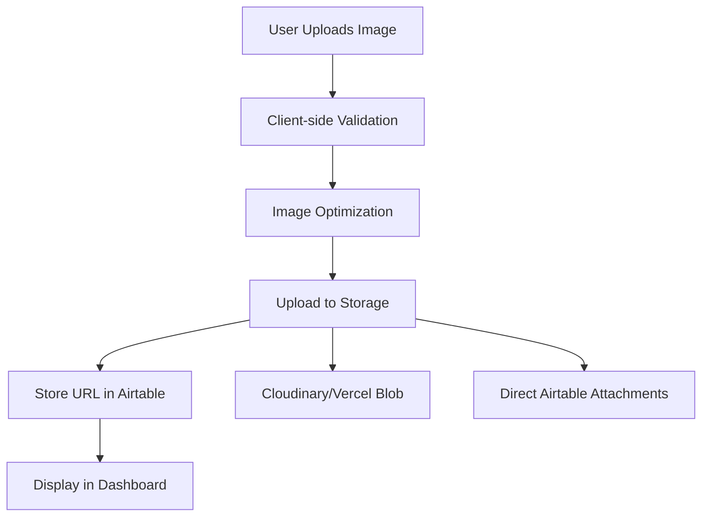
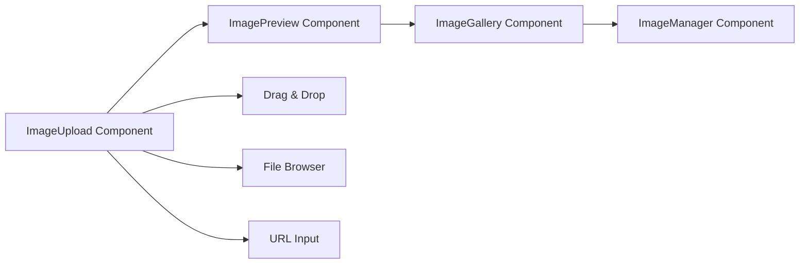

# Image Management Implementation Plan

## Overview
Complete image management system for Green Mission Dashboard with two-phase implementation:
- **Phase 1**: Basic logo upload for simplified mode
- **Phase 2**: Advanced image gallery with multiple business images

## Technical Architecture

### Image Storage Strategy


### Feature Flag Integration
- `imageManagement`: Controls basic image upload functionality
- `advancedImageFeatures`: Controls multiple images and gallery features
- Integrates with existing simplified dashboard mode

### UI Components Architecture


## Implementation Details

### Phase 1: Basic Image Upload
- Single logo upload in Basic Info tab
- Drag-and-drop interface with file browser fallback
- Direct Airtable attachment storage
- Validation: JPG, PNG, WebP, SVG | Max 5MB | Min 200x200px

### Phase 2: Advanced Image Management
- Multiple business images (up to 5)
- Image gallery with reordering capabilities
- Image optimization and resizing
- Cloud storage integration (Cloudinary/Vercel Blob)

### Essential Fields Update
```typescript
export const ESSENTIAL_FIELDS = [
  'businessName',
  'description', 
  'industry',
  'email',
  'city',
  'country',
  'website',
  'phone',
  'logo' // Added for Phase 1
] as const;
```

### Component Specifications

#### ImageUpload Component
```typescript
interface ImageUploadProps {
  value?: string | string[]
  onChange: (urls: string | string[]) => void
  multiple?: boolean
  maxSize?: number
  acceptedTypes?: string[]
  placeholder?: string
  disabled?: boolean
}
```

#### Validation Rules
- **File Types**: JPG, PNG, WebP, SVG (for logos)
- **File Size**: Max 5MB for logos, 10MB for business images
- **Dimensions**: Minimum 200x200px for logos
- **Quantity**: 1 logo + up to 5 business images

## Integration Points

### Form Integration
- **Basic Info Tab**: Logo upload field
- **Contact Tab**: No changes (maintains simplicity)
- **Advanced Mode**: Business image gallery (Phase 2)

### API Updates
- Update business listing API for image uploads
- Server-side image validation
- Image URL processing for Airtable storage
- Image deletion endpoints

### Database Schema
- Map to existing Airtable `Logo` and `Business Images` fields
- Handle image metadata and URLs
- Update form-to-Airtable mapping functions

## Success Criteria

### Phase 1
- ✅ Users can upload business logos
- ✅ Images display correctly in dashboard
- ✅ Images sync to Airtable properly
- ✅ Mobile-responsive image upload
- ✅ Proper error handling and validation

### Phase 2
- ✅ Multiple business image management
- ✅ Image optimization and compression
- ✅ Advanced image editing features
- ✅ Cloud storage integration
- ✅ Image gallery with reordering

## Risk Mitigation
- **File Size Limits**: Client-side compression
- **Upload Failures**: Retry logic and progress indicators
- **Storage Costs**: Start with Airtable, migrate to optimized storage
- **Performance**: Lazy loading and image optimization
- **Mobile Usage**: Touch-friendly upload interface

## Timeline
- **Phase 1**: 1-2 weeks (basic logo upload)
- **Phase 2**: 2-3 weeks (advanced features)
- **Total**: 3-5 weeks for complete implementation